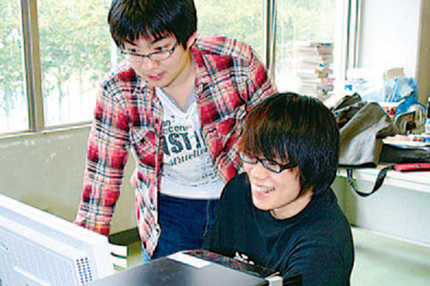

# 情報工学科の紹介
<!-- Markdown記法を使って学科の紹介ページを作る -->

##プログラミングについて学ぶことができる
<li>今はレベルの高いプログラミング技術が求められる現代です。</li><li>この情報工学科では基礎レベルから応用レベルまで学ぶことができ、またコース選択により自分の望む技術を身につけ、社会に出た時に人を導くことのできる、総合的能力を身につけることができます。
####3つのコース
1. システムエンジニアリングコース
プログラミングによって時代の求める新しい情報システムを作る

2. インターネット&セキュリティコース
安心で安全できるネットワークとセキュリティを学ぶ

3. 知能情報コース
モノとコトの未来へAIの先を拓く

拓殖大学
http://www.takushoku-u.ac.jp/
📞電話番号03-3947-7111

<!-- この部分より上に記述を追加して下のチェックボックスで確認する -->
- [ ] 2種類以上の見出し(headers)を使っている．
- [ ] 2種類以上の強調(emphasis)を使っている．
- [ ] (番号付きの)リスト(ordered lists)を使っている
- [ ] (番号無しの)リスト(unordered lists)を使っている．
- [ ] 1つ以上の画像(images)を使っている．
- [ ] 1つ以上のリンク(links)を使っている．
- [ ] 1つ以上の表(tables)を使っている．
- [ ] 1つ以上の絵文字を使っている．
-
